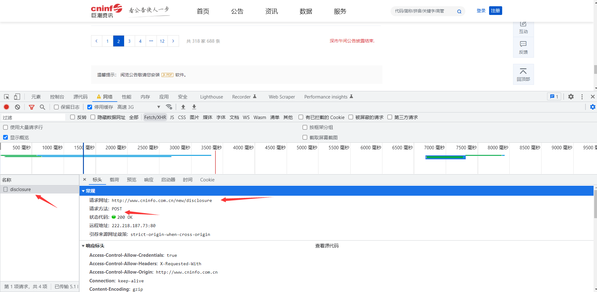
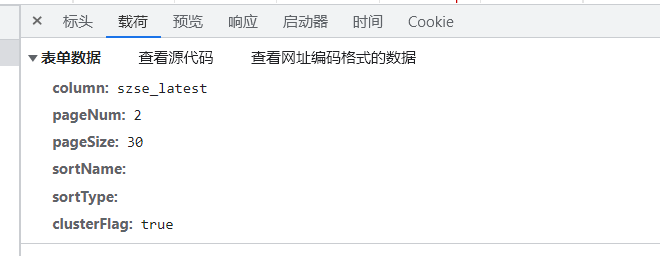
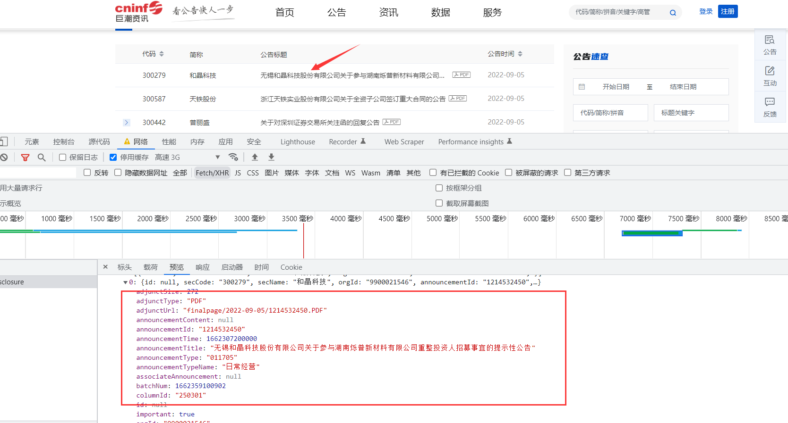
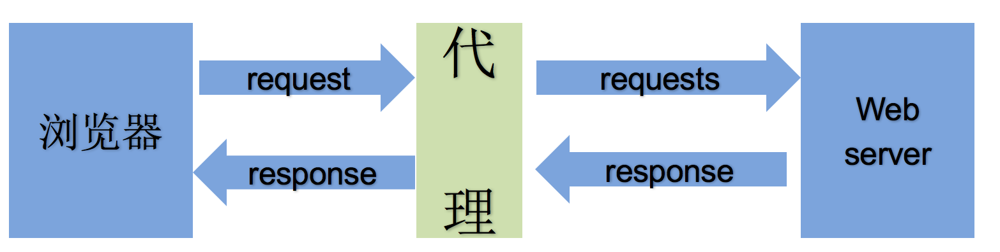
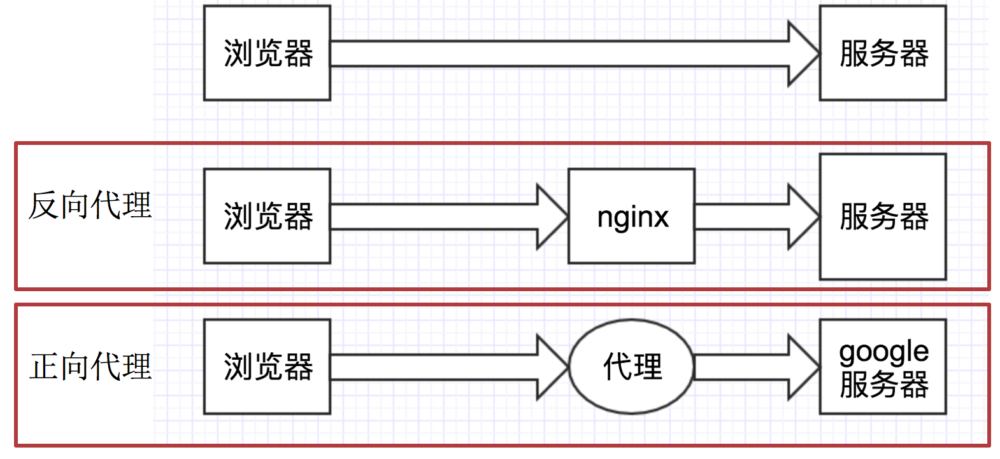
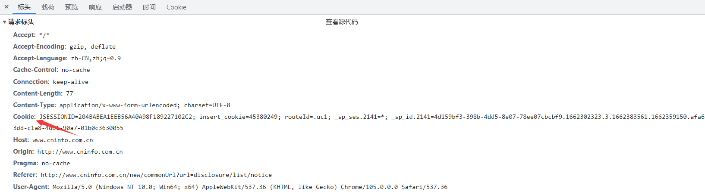
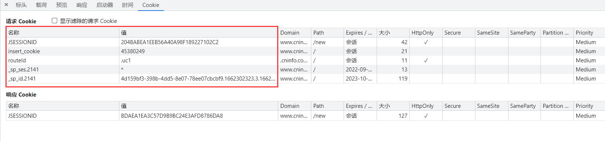
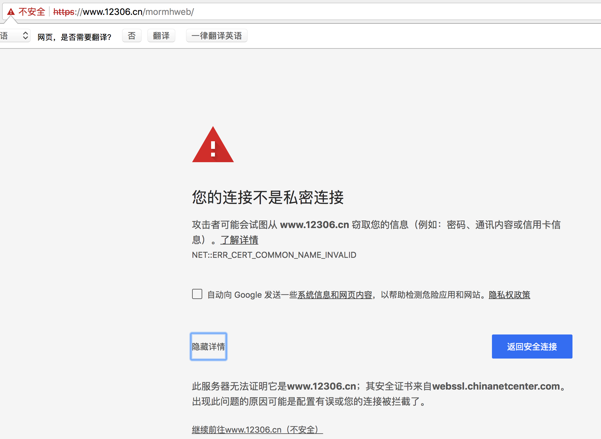

# requests发送请

**学习目标：**

1. 掌握 requests的基本使用
2. 掌握 response常见的属性
3. 掌握 requests模块发送带参数的get请求
4. 能够应用requests发送post请求的方法
5. 能够应用requests模块使用代理的方法
6. 掌握requests处理cookie的三种方法
7. 掌握requests解决https证书错误的问题
8. 掌握requests中超时参数的使用
9. 掌握retrying模块的使用


## 一、requests入门使用

上一节中，我们了解了socket获取数据的方法，但是其中确实有不方便的地方，特别麻烦，比如需要自己处理http协议，处理响应信息。为了更加方便地实现这些操作，就有了更为强大的库requests，有了它，Cookies、登录验证、代理设置等操作都不是事儿。


### 1. requests的作用

​	作用：发送网络请求，返回响应数据

​	中文文档 ： https://www.w3cschool.cn/requests2/

​	通过观察文档来学习：如何使用requests来发送网络请求


### 2.requests模块发送简单的get请求、获取响应

需求：通过requests向百度首页发送请求，获取百度首页的数据

```
import requests 

# 目标url
url = 'https://www.baidu.com' 

# 向目标url发送get请求
response = requests.get(url)

# 打印响应内容
print(response.text)
```


#### 2.1response的常用属性：

- `response.text` 响应体 str类型
- `respones.content` 响应体 bytes类型
- `response.status_code` 响应状态码
- `response.request.headers` 请求头
- `response.headers` 响应头
- `response.cookies` 响应的cookie（经过了set-cookie动作）


##### 2.2response.text 和response.content的区别

- `response.text`
  - 类型：str
  - 解码类型： requests模块自动根据HTTP 头部对响应的编码作出有根据的推测，推测的文本编码
  - 如何修改编码方式：`response.encoding=”gbk”`
- `response.content`
  - 类型：bytes
  - 解码类型： 没有指定
  - 如何修改编码方式：`response.content.deocde(“utf8”)`

获取网页源码的通用方式：

1. `response.content.decode()`
2. `response.content.decode("GBK")`
3. `response.text`


##### 2.3实战练习：获取到百度的图标

**分析：**

- 图片的url: https://www.baidu.com/img/PCtm_d9c8750bed0b3c7d089fa7d55720d6cf.png
- 利用requests模块发送请求获取响应
- 以2进制写入的方式打开文件，并将response响应的二进制内容写入

```
import requests

# 图片的url
url = 'https://www.baidu.com/img/bd_logo1.png' 

# 响应本身就是一个图片,并且是二进制类型
response = requests.get(url) 

# print(response.content)

# 以二进制+写入的方式打开文件
with open('baidu.png', 'wb') as f: 
    # 写入response.content bytes二进制类型
    f.write(response.content)
```


### 3.发送带header的请求

​	我们先写一个获取百度首页的代码

```
import requests

url = 'https://www.baidu.com'

response = requests.get(url)

print(response.content)

# 打印响应对应请求的请求头信息
print(response.request.headers)
```


##### 3.1 思考

对比浏览器上百度首页的网页源码和代码中的百度首页的源码，有什么不同？

代码中的百度首页的源码非常少，为什么？


##### 3.2 为什么请求需要带上header？

模拟浏览器，欺骗服务器，获取和浏览器一致的内容


##### 3.3 header的形式：字典

`headers = {"User-Agent": "Mozilla/5.0 (Windows NT 10.0; Win64; x64) AppleWebKit/537.36 (KHTML, like Gecko) Chrome/54.0.2840.99 Safari/537.36"}`


##### 3.4 用法

`requests.get(url, headers=headers)`


##### 3.5 完整的代码

```
import requests

url = 'https://www.baidu.com'

headers = {"User-Agent": "Mozilla/5.0 (Windows NT 10.0; Win64; x64) AppleWebKit/537.36 (KHTML, like Gecko) Chrome/54.0.2840.99 Safari/537.36"}

# 在请求头中带上User-Agent，模拟浏览器发送请求
response = requests.get(url, headers=headers) 

# print(response.content)

# 打印请求头信息
print(response.request.headers)
```


### 4. 发送带参数的请求

> 我们在使用百度搜索的时候经常发现url地址中会有一个 `?`，那么该问号后边的就是请求参数，又叫做查询字符串


##### 4.1 什么叫做请求参数：

例1： [http://www.webkaka.com/tutorial/server/2015/021013/](http://www.webkaka.com/tutorial/server/2015/021013/)

例2：[https://www.baidu.com/s?wd=python&a=c](https://www.baidu.com/s?wd=python&a=c)

例1中没有请求参数！例2中?后边的就是请求参数


##### 4.2 请求参数的形式：字典

`kw = {'wd':'python'}`


##### 4.3 请求参数的用法

`	requests.get(url,params=kw)`


##### 4.4 关于参数的注意点

在url地址中， 很多参数是没有用的，比如百度搜索的url地址，其中参数只有一个字段有用，其他的都可以删除 如何确定那些请求参数有用或者没用：挨个尝试！ 对应的,在后续的爬虫中，越到很多参数的url地址，都可以尝试删除参数


##### 4.5 两种方式：发送带参数的请求

1. 对`https://www.baidu.com/s?wd=python`发起请求可以使用`requests.get(url, params=kw)`的方式

```
# 方式一：利用params参数发送带参数的请求
import requests

headers = {"User-Agent": "Mozilla/5.0 (Windows NT 10.0; Win64; x64) AppleWebKit/537.36 (KHTML, like Gecko) Chrome/54.0.2840.99 Safari/537.36"}

# 这是目标url
# url = 'https://www.baidu.com/s?wd=python' 

# 最后有没有问号结果都一样
url = 'https://www.baidu.com/s?' 

# 请求参数是一个字典 即wd=python
kw = {'wd': 'python'} 

# 带上请求参数发起请求，获取响应
response = requests.get(url, headers=headers, params=kw) 

# 当有多个请求参数时，requests接收的params参数为多个键值对的字典，比如 '?wd=python&a=c'-->{'wd': 'python', 'a': 'c'}

print(response.content)
```

1. 也可以直接对`https://www.baidu.com/s?wd=python`完整的url直接发送请求，不使用params参数

```
# 方式二：直接发送带参数的url的请求
import requests

headers = {"User-Agent": "Mozilla/5.0 (Windows NT 10.0; Win64; x64) AppleWebKit/537.36 (KHTML, like Gecko) Chrome/54.0.2840.99 Safari/537.36"}

url = 'https://www.baidu.com/s?wd=python'

# kw = {'wd': 'python'}

# url中包含了请求参数，所以此时无需params
response = requests.get(url, headers=headers)
```


## 二、requests模块的深入使用

### 1.使用requests发送POST请求

> 思考：哪些地方我们会用到POST请求？

1. 登录注册（ POST 比 GET 更安全）
2. 需要传输大文本内容的时候（ POST 请求对数据长度没有要求，get请求的长度限制 IE：对URL的最大限制为2083个字符，若超出这个数字，提交按钮没有任何反应。Firefox：对Firefox浏览器URL的长度限制为：65536个字符。Safari：URL最大长度限制为80000个字符。Opera：URL最大长度限制为190000个字符。）

所以同样的，我们的爬虫也需要在这两个地方回去模拟浏览器发送post请求


##### 1.1 requests发送post请求语法：

- 用法：

  ```
    response = requests.post("http://www.baidu.com/", \
    data = data,headers=headers)
  ```

- data 的形式：字典

  ​


##### 1.2 POST请求练习

下面面我们通过巨潮资讯例子看看post请求如何使用：

地址：http://www.cninfo.com.cn/new/commonUrl?url=disclosure/list/notice#szse

##### 思路分析

1. 抓包确定请求的url地址

   

   ​

2. 确定请求的参数

   

   ​

3. 确定返回数据的位置

   

   ​

4. 模拟浏览器获取数据

5. 完整代码案列：

   ```
   #!/usr/bin/env python
   # -*- encoding: utf-8 -*-
   # @File  :   巨潮网.py    
   # Author :   柏汌  

   import requests

   # 获取到url
   url = 'http://www.cninfo.com.cn/new/disclosure'
   headers = {
       'User-Agent': 'Mozilla/5.0 (Windows NT 10.0; Win64; x64) AppleWebKit/537.36 (KHTML, like Gecko) Chrome/104.0.0.0 Safari/537.36'
   }
   data = {
   'column':'szse_latest',
   'pageNum':'2',
   'pageSize':'30',
   'sortName':'',
   'sortType':'',
   'clusterFlag':'true',
   }

   response = requests.post(url, headers=headers, data=data)
   print(response.json())
   ```


### 2.使用代理

##### 2.1 为什么要使用代理

1. 让服务器以为不是同一个客户端在请求
2. 防止我们的真实地址被泄露，防止被追究

##### 2.2 理解使用代理的过程



##### 2.3 理解正向代理和反向代理的区别



通过上图可以看出：

- 正向代理：对于浏览器知道服务器的真实地址，例如VPN
- 反向代理：浏览器不知道服务器的真实地址，例如nginx

##### 2.4 代理的使用

- 用法：

  ```
    requests.get("http://httpbin.org/ip",  proxies = proxies)
  ```

- proxies的形式：字典

- 例如：

  ```
   import requests

  proxies = {
        "http": "http://101.200.127.149:3129",
        }
  response = requests.get("http://httpbin.org/ip", proxies=proxies, timeout=3)
  print(response.text)

  ```

**免费的ip代理网站**

```
免费代理IP http://ip.yqie.com/ipproxy.htm
66免费代理网 http://www.66ip.cn/
89免费代理 http://www.89ip.cn/
无忧代理 http://www.data5u.com/
云代理 http://www.ip3366.net/
快代理 https://www.kuaidaili.com/free/
极速专享代理 http://www.superfastip.com/
HTTP代理IP https://www.xicidaili.com/wt/
小舒代理 http://www.xsdaili.com
小幻HTTP代理 http://www.feilongip.com/
全网代理IP http://www.goubanjia.com/
飞龙代理IP http://www.feilongip.com/
西拉免费代理IP http://www.xiladaili.com/
```


##### 2.5 代理IP的分类

根据代理ip的匿名程度，代理IP可以分为下面四类：

- 透明代理(Transparent Proxy)：透明代理虽然可以直接“隐藏”你的IP地址，但是还是可以查到你是谁。
- 匿名代理(Anonymous Proxy)：使用匿名代理，别人只能知道你用了代理，无法知道你是谁。
- 高匿代理(Elite proxy或High Anonymity Proxy)：高匿代理让别人根本无法发现你是在用代理，所以是最好的选择。

在使用的使用，毫无疑问使用高匿代理效果最好

从请求使用的协议可以分为：

- http代理
- https代理
- socket代理等

不同分类的代理，在使用的时候需要根据抓取网站的协议来选择

##### 2.6 代理IP使用的注意点

- 反反爬

  使用代理ip是非常必要的一种`反反爬`的方式

  但是即使使用了代理ip，对方服务器任然会有很多的方式来检测我们是否是一个爬虫，比如：

  - 一段时间内，检测IP访问的频率，访问太多频繁会屏蔽

  - 检查Cookie，User-Agent，Referer等header参数，若没有则屏蔽

  - 服务方购买所有代理提供商，加入到反爬虫数据库里，若检测是代理则屏蔽

    所以更好的方式在使用代理ip的时候使用随机的方式进行选择使用，不要每次都用一个代理ip

- 代理ip池的更新

  购买的代理ip很多时候大部分(超过10%)可能都没办法使用，这个时候就需要通过程序去检测哪些可用，把不能用的删除掉。


## 三、requess模块处理cookie相关的请求

### 1.爬虫中使用cookie

> 为了能够通过爬虫获取到登录后的页面，或者是解决通过cookie的反扒，需要使用request来处理cookie相关的请求

##### 1.1 爬虫中使用cookie的利弊

1. 带上cookie的好处
   - 能够访问登录后的页面
   - 能够实现部分反反爬
2. 带上cookie的坏处
   - 一套cookie往往对应的是一个用户的信息，请求太频繁有更大的可能性被对方识别为爬虫
   - 那么上面的问题如何解决 ?使用多个账号

##### 1.2 requests处理cookie的方法

使用requests处理cookie有三种方法：

1. cookie字符串放在headers中
2. 把cookie字典放传给请求方法的cookies参数接收
3. 使用requests提供的session模块


### 2.cookie添加在heades中

练习网站：巨潮资讯  网址：http://www.cninfo.com.cn/new/commonUrl?url=disclosure/list/notice#szse

##### 2.1 headers中cookie的位置



- headers中的cookie：
  - 使用分号(;)隔开
  - 分号两边的类似a=b形式的表示一条cookie
  - a=b中，a表示键（name），b表示值（value）
  - 在headers中仅仅使用了cookie的name和value


##### 2.2 cookie的具体组成的字段



由于headers中对cookie仅仅使用它的name和value，所以在代码中我们仅仅需要cookie的name和value即可


##### 2.3 在headers中使用cookie

复制浏览器中的cookie到代码中使用

```
headers = {

"User-Agent":"Mozilla/5.0 (Macintosh; Intel Mac OS X 10134) AppleWebKit/537.36 (KHTML, like Gecko) Chrome/65.0.3325.181 Safari/537.36",

"Cookie":"JSESSIONID=204BABEA1EEB56A40A98F189227102C2; insert_cookie=45380249; routeId=.uc1; _sp_ses.2141=*; _sp_id.2141=4d159bf3-398b-4dd5-8e07-78ee07cbcbf9.1662302323.3.1662383561.1662359150.afa633dd-c1a8-4d81-90a7-01b0c3630055"}

requests.get(url,headers=headers)

```

##### 注意：

​	cookie有过期时间 ，所以直接复制浏览器中的cookie可能意味着下一程序继续运行的时候需要替换代码中的cookie，对应的我们也可以通过一个程序专门来获取cookie供其他程序使用；当然也有很多网站的cookie过期时间很长，这种情况下，直接复制cookie来使用更加简单


### 3.使用cookies参数接收字典形式的cookie

- cookies的形式：字典

```
cookies = {
'JSESSIONID':'204BABEA1EEB56A40A98F189227102C',
'insert_cookie':'45380249',
'routeId':'.uc1',
'_sp_ses.2141':'*',
'_sp_id.2141':'4d159bf3-398b-4dd5-8e07-78ee07cbcbf9.1662302323.3.1662383561.1662359150.afa633dd-c1a8-4d81-90a7-01b0c3630055'

}
```

- 使用方法：

```


    import requests
    
    # 获取到url地址
    
    url = 'http://www.cninfo.com.cn/new/disclosure'
    
    headers = {
    'User-Agent': 'Mozilla/5.0 (Windows NT 10.0; Win64; x64) AppleWebKit/537.36 (KHTML, like Gecko) Chrome/104.0.0.0 Safari/537.36'
    }
    cookies = {
    'JSESSIONID':'204BABEA1EEB56A40A98F189227102C',
    'insert_cookie':'45380249',
    'routeId':'.uc1',
    '_sp_ses.2141':'*',
    '_sp_id.2141':'4d159bf3-398b-4dd5-8e07-78ee07cbcbf9.1662302323.3.1662383561.1662359150.afa633dd-c1a8-4d81-90a7-01b0c3630055'
    }
    response = requests.get(url,headers=headers,cookies=cookies)
    # 查看请求的cookie
    print(response.request.headers['Cookie'])
    # 查看响应的cookie
    print(response.cookies)
```

### 4.使用requests.session处理cookie

> 前面使用手动的方式使用cookie，那么有没有更好的方法在requets中处理cookie呢？

requests 提供了一个叫做session类，来实现客户端和服务端的`会话保持`

会话保持有两个内涵：

- 保存cookie，下一次请求会带上前一次的cookie
- 实现和服务端的长连接，加快请求速度

##### 4.1 使用方法

```

session = requests.session()
response = session.get(url,headers)
```

session实例在请求了一个网站后，对方服务器设置在本地的cookie会保存在session中，下一次再使用session请求对方服务器的时候，会带上前一次的cookie

##### 4.2 动手练习：

动手尝试使用session来获取到巨潮资讯首页请求返回的cookie，在访问巨潮资讯的动态接口页面

**思路分析**

1. 准备url地址和请求参数
2. 构造session发送get请求
3. 使用session访问动态接口数据，看看是否请求成功


##### 4.2 代码实战：

```
#!/usr/bin/env python
# -*- encoding: utf-8 -*-
# @File  :   cookie携带.py    
# Author :   柏汌  

# cookirJar

import requests

url = 'http://www.cninfo.com.cn/new/commonUrl?url=disclosure/list/notice'
# 获取到url地址
url1 = 'http://www.cninfo.com.cn/new/disclosure'
headers = {
    'User-Agent': 'Mozilla/5.0 (Windows NT 10.0; Win64; x64) AppleWebKit/537.36 (KHTML, like Gecko) Chrome/104.0.0.0 Safari/537.36'
}
session = requests.session()
response = session.get(url, headers=headers)
# 观察第一次请求的返回的cookie信息
print(response.cookies)

res = session.get(url1, headers=headers)
# 观察第二次请求携带的cookie信息
print(res.request.headers)
```


## 四、requests模块的其他方法

### 1.requests中cookirJar的处理方法

> 使用request获取的resposne对象，具有cookies属性，能够获取对方服务器设置在本地的cookie，但是如何使用这些cookie呢？

##### 1.1 方法介绍

1. response.cookies是CookieJar类型
2. 使用requests.utils.dict_from_cookiejar，能够实现把cookiejar对象转化为字典

##### 1.2 方法展示

```
import requests

url = "http://www.baidu.com"
#发送请求，获取resposne
response = requests.get(url)
print(type(response.cookies))

#使用方法从cookiejar中提取数据
cookies = requests.utils.dict_from_cookiejar(response.cookies)
print(cookies)

```

输出为:

```
<class 'requests.cookies.RequestsCookieJar'>
{'BDORZ': '27315'}
```

##### 注意：

在前面的requests的session类中，我们不需要处理cookie的任何细节，如果有需要，我们可以使用上述方法来解决

### 2.requests处理证书错误

> 经常我们在网上冲浪时，经常能够看到下面的提示：



出现这个问题的原因是：ssl的证书不安全导致

##### 2.1 代码中发起请求的效果

那么如果在代码中请求会怎么样呢？

```
import requests

url = "https://www.12306.cn/mormhweb/"
response = requests.get(url)

```

返回证书错误，如下：

```
ssl.CertificateError ...
```

##### 2.2 解决方案

为了在代码中能够正常的请求，我们修改添加一个参数

```
import requests

url = "https://www.12306.cn/mormhweb/"
response = requests.get(url,verify=False)
```

### 3.超时参数的使用

> 在平时网上冲浪的过程中，我们经常会遇到网络波动，这个时候，一个请求等了很久可能任然没有结果
>
> 在爬虫中，一个请求很久没有结果，就会让整个项目的效率变得非常低，这个时候我们就需要对请求进行强制要求，让他必须在特定的时间内返回结果，否则就报错

##### 3.1 超时参数使用方法如下：

```
response = requests.get(url,timeout=3)

```

通过添加timeout参数，能够保证在3秒钟内返回响应，否则会报错

##### 注意：

这个方法还能够拿来检测代理ip的质量，如果一个代理ip在很长时间没有响应，那么添加超时之后也会报错，对应的这个ip就可以从代理ip池中删除

### 4.retrying模块的使用

> 使用超时参数能够加快我们整体的请求速度，但是在正常的网页浏览过成功，如果发生速度很慢的情况，我们会做的选择是**刷新页面**，那么在代码中，我们是否也可以刷新请求呢？

对应的，retrying模块就可以帮助我们解决

##### 4.1 retrying模块的使用

retrying模块的地址：[https://pypi.org/project/retrying/](https://pypi.org/project/retrying/)

retrying模块安装方法：pip install retrying

retrying 模块的使用

1. 使用retrying模块提供的retry模块
2. 通过装饰器的方式使用，让被装饰的函数反复执行
3. retry中可以传入参数`stop_max_attempt_number`,让函数报错后继续重新执行，达到最大执行次数的上限，如果每次都报错，整个函数报错，如果中间有一个成功，程序继续往后执行

##### 4.2 retrying和requests的简单封装

实现一个发送请求的函数，每次爬虫中直接调用该函数即可实现发送请求，在其中

- 使用timeout实现超时报错
- 使用retrying模块实现重试

代码参考:

```
# parse.py
import requests
from retrying import retry

headers = {}

#最大重试3次，3次全部报错，才会报错
@retry(stop_max_attempt_number=3) 
def _parse_url(url)
    #超时的时候回报错并重试
    response = requests.get(url, headers=headers, timeout=3) 
    #状态码不是200，也会报错并重试
    assert response.status_code == 200
    return response


def parse_url(url)
    try: #进行异常捕获
        response = _parse_url(url)
    except Exception as e:
        print(e)
        #报错返回None
        response = None
    return response
```

