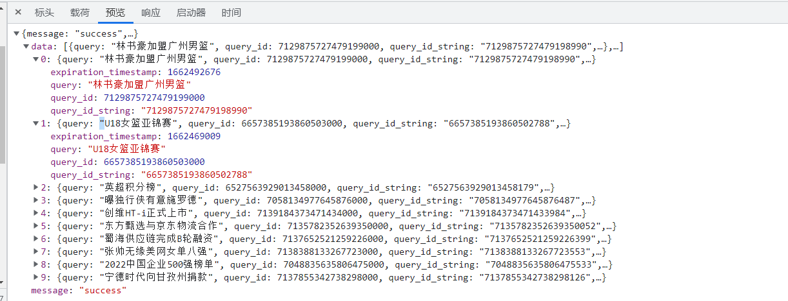
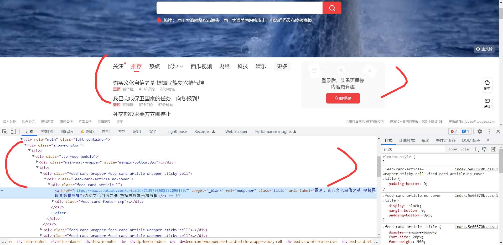
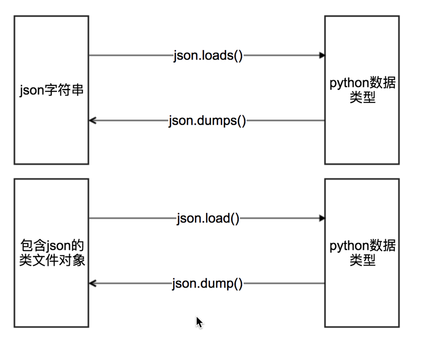
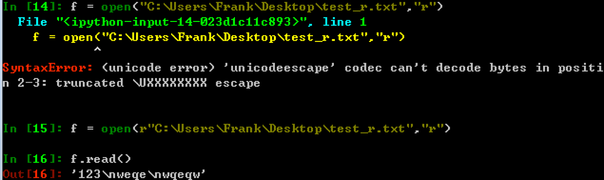
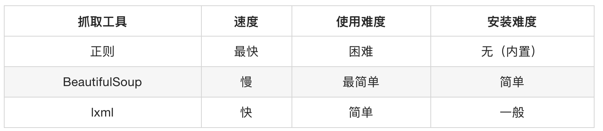
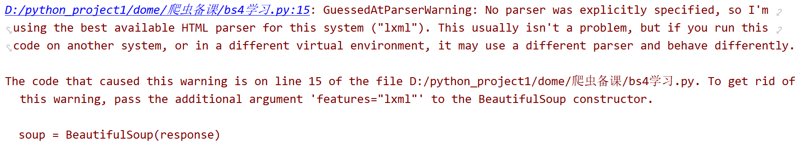

# 数据提取方法

#### 学习目标

1. 了解 爬虫的数据的分类
2. 掌握 json相关的方法(load loads dump dumps)
3. 掌握 正则表达式的常见语法
4. 掌握 re模块的常见用法
5. 掌握 xpath获取节点属性的方法
6. 掌握 BS4的使用流程
7. 掌握 BS4的find_all,find,select方法解析数据


## 一、数据提取的概念和数据的分类

### 1 .爬虫中数据的分类

> 在爬虫爬取的数据中有很多不同类型的数据,我们需要了解数据的不同类型来又规律的提取和解析数据.

- 结构化数据：json，xml等
  - 处理方式：直接转化为python类型
- 非结构化数据：HTML
  - 处理方式：正则表达式、xpath、bs4

下面以今日头条的首页为例，介绍结构化数据和非结构化数据

网址：https://www.toutiao.com/

- 结构化数据例子：



- 非结构化数据：



- XML数据：

```
<bookstore>
<book category="COOKING">
  <title lang="en">Everyday Italian</title> 
  <author>Giada De Laurentiis</author> 
  <year>2005</year> 
  <price>30.00</price> 
</book>
<book category="CHILDREN">
  <title lang="en">Harry Potter</title> 
  <author>J K. Rowling</author> 
  <year>2005</year> 
  <price>29.99</price> 
</book>
<book category="WEB">
  <title lang="en">Learning XML</title> 
  <author>Erik T. Ray</author> 
  <year>2003</year> 
  <price>39.95</price> 
</book>
</bookstore>
```

从上面可以看出，xml数据也是结构非常明显的

### 2 小结

1. 爬虫中数据分类之结构化数据: json,xml
2. 爬虫中数据分类之非结构化数据:Html,字符串
3. 结构化数据处理的方式有:xpath,转换python类型处理,bs4
4. 非结构化数据处理方式有:正则表达式,xpath,bs4


## 二、json的数据提取

### 1 复习什么是json

JSON(JavaScript Object Notation) 是一种轻量级的数据交换格式，它使得人们很容易的进行阅读和编写。同时也方便了机器进行解析和生成。适用于进行数据交互的场景，比如网站前台与后台之间的数据交互。

### 2 json模块中方法的学习



其中类文件对象的理解：

> 具有read()或者write()方法的对象就是类文件对象，比如f = open(“a.txt”,”r”) f就是类文件对象

具体使用方法：

```
#json.dumps 实现python类型转化为json字符串
#indent实现换行和空格
#ensure_ascii=False实现让中文写入的时候保持为中文
json_str = json.dumps(mydict,indent=2,ensure_ascii=False)

#json.loads 实现json字符串转化为python的数据类型
my_dict = json.loads(json_str)


#json.dump 实现把python类型写入类文件对象
with open("temp.txt","w") as f:
    json.dump(mydict,f,ensure_ascii=False,indent=2)

# json.load 实现类文件对象中的json字符串转化为python类型
with open("temp.txt","r") as f:
    my_dict = json.load(f)
```


## 三、数据提取之正则

### 1.什么是正则表达式

用事先定义好的一些特定字符、及这些特定字符的组合，组成一个**规则字符串**，这个**规则字符串**用来表达对字符串的一种**过滤**逻辑。


### 2. re模块的介绍

在Python中需要通过正则表达式对字符串进行匹配的时候，可以使用一个 re 模块

```
# 导入re模块
import re

# 使用match方法进行匹配操作
result = re.match(正则表达式,要匹配的字符串)

# 如果上一步匹配到数据的话，可以使用group方法来提取数据
result.group()
```

#### 2.1. re模块的使用

```\
import re


# 使用match方法进行匹配操作 从头开始匹配
result = re.match("tuling","tuling.cn")
# 获取匹配结果
info = result.group()
print(info)
```

**运行结果:**	

```
tuling
```


### 3.匹配单个字符

在上一小节中，了解到通过re模块能够完成使用正则表达式来匹配字符串

本小节，将要讲解正则表达式的单字符匹配

| 代码   | 功能                        |
| ---- | ------------------------- |
| .    | 匹配任意1个字符（除了\n）            |
| [ ]  | 匹配[ ]中列举的字符               |
| \d   | 匹配数字，即0-9                 |
| \D   | 匹配非数字，即不是数字               |
| \s   | 匹配空白，即 空格，tab键            |
| \S   | 匹配非空白                     |
| \w   | 匹配非特殊字符，即a-z、A-Z、0-9、_、汉字 |
| \W   | 匹配特殊字符，即非字母、非数字、非汉字       |

#### 3.1示例1： .

```
import re

ret = re.match(".","M")
print(ret.group())

ret = re.match("t.o","too")
print(ret.group())

ret = re.match("t.o","two")
print(ret.group())

```

运行结果：

```
M
too
two

```

#### 3.2示例2：[]

```
import re

# 如果hello的首字符小写，那么正则表达式需要小写的h
ret = re.match("h","hello Python") 
print(ret.group())


# 如果hello的首字符大写，那么正则表达式需要大写的H
ret = re.match("H","Hello Python") 
print(ret.group())

# 大小写h都可以的情况
ret = re.match("[hH]","hello Python")
print(ret.group())
ret = re.match("[hH]","Hello Python")
print(ret.group())
ret = re.match("[hH]ello Python","Hello Python")
print(ret.group())

# 匹配0到9第一种写法
ret = re.match("[0123456789]Hello Python","7Hello Python")
print(ret.group())

# 匹配0到9第二种写法
ret = re.match("[0-9]Hello Python","7Hello Python")
print(ret.group())

ret = re.match("[0-35-9]Hello Python","7Hello Python")
print(ret.group())

# 下面这个正则不能够匹配到数字4，因此ret为None
ret = re.match("[0-35-9]Hello Python","4Hello Python")
# print(ret.group())
```

运行结果：

```
h
H
h
H
Hello Python
7Hello Python
7Hello Python
7Hello Python
```

#### 3.3示例3：\d

```
import re

# 普通的匹配方式
ret = re.match("嫦娥1号","嫦娥1号发射成功") 
print(ret.group())

ret = re.match("嫦娥2号","嫦娥2号发射成功") 
print(ret.group())

ret = re.match("嫦娥3号","嫦娥3号发射成功") 
print(ret.group())

# 使用\d进行匹配
ret = re.match("嫦娥\d号","嫦娥1号发射成功") 
print(ret.group())

ret = re.match("嫦娥\d号","嫦娥2号发射成功") 
print(ret.group())

ret = re.match("嫦娥\d号","嫦娥3号发射成功") 
print(ret.group())

```

运行结果：

```
嫦娥1号
嫦娥2号
嫦娥3号
嫦娥1号
嫦娥2号
嫦娥3号

```

#### 3.4示例4：\D

```
import re

match_obj = re.match("\D", "f")
if match_obj:
    # 获取匹配结果
    print(match_obj.group())
else:
    print("匹配失败")
```

运行结果:

```
f

```

#### 3.5示例5：\s

```
import re

# 空格属于空白字符
match_obj = re.match("hello\sworld", "hello world")
if match_obj:
    result = match_obj.group()
    print(result)
else:
    print("匹配失败")


# \t 属于空白字符
match_obj = re.match("hello\sworld", "hello\tworld")
if match_obj:
    result = match_obj.group()
    print(result)
else:
    print("匹配失败")
```

运行结果:

```
hello world
hello world

```

#### 3.6示例6：\S

```
import re

match_obj = re.match("hello\Sworld", "hello&world")
if match_obj:
result = match_obj.group()
print(result)
else:
print("匹配失败")


match_obj = re.match("hello\Sworld", "hello$world")
if match_obj:
result = match_obj.group()
print(result)
else:
print("匹配失败")
```

运行结果:

```
hello&world  
hello$world

```

#### 3.7示例7：\w

```
import re

# 匹配非特殊字符中的一位
match_obj = re.match("\w", "A")
if match_obj:
    # 获取匹配结果
    print(match_obj.group())
else:
    print("匹配失败")

```

执行结果:

```
A

```

#### 3.8示例8：\W

```
# 匹配特殊字符中的一位
match_obj = re.match("\W", "&")
if match_obj:
    # 获取匹配结果
    print(match_obj.group())
else:
    print("匹配失败")
```

执行结果:

```
&
```


### 4. re模块的常见方法

- pattern.match（从头找一个）

- pattern.search（找一个）

- **pattern.findall（找所有）**返回一个列表，没有就是空列表`re.findall("\d","tu1ling2") >> ["1","2"]`

- pattern.sub（替换）

  - `re.sub("\d","_","tu1ling2") >> ["tu_ling_"]`

- re.compile（编译）

  - 返回一个模型P，具有和re一样的方法，但是传递的参数不同

  - 匹配模式需要传到compile中

    ```
    p = re.compile("\d",re.S)
    p.findall("tuling2")
    ```

- re的修饰符

| 修饰符  | 描述                                      |
| ---- | --------------------------------------- |
| re.I | 使匹配对大小写不敏感                              |
| re.L | 做本地化识别（locale-aware）匹配                  |
| re.M | 多行匹配，影响 ^ 和 $                           |
| re.S | 使 . 匹配包括换行在内的所有字符                       |
| re.U | 根据Unicode字符集解析字符。这个标志影响 \w, \W, \b, \B. |
| re.X | 该标志通过给予你更灵活的格式以便你将正则表达式写得更易于理解。         |


### 5.匹配多个字符

#### 5.1 匹配多个字符

| 代码    | 功能                          |
| ----- | --------------------------- |
| *     | 匹配前一个字符出现0次或者无限次，即可有可无      |
| +     | 匹配前一个字符出现1次或者无限次，即至少有1次     |
| ?     | 匹配前一个字符出现1次或者0次，即要么有1次，要么没有 |
| {m}   | 匹配前一个字符出现m次                 |
| {m,n} | 匹配前一个字符出现从m到n次              |

#### 5.2示例1：*

需求：匹配出一个字符串第一个字母为大写字符，后面都是小写字母并且这些小写字母可 有可无

```
import re

ret = re.match("[A-Z][a-z]*","M")
print(ret.group())

ret = re.match("[A-Z][a-z]*","MnnM")
print(ret.group())

ret = re.match("[A-Z][a-z]*","Aabcdef")
print(ret.group())
```

运行结果：

```
M
Mnn
Aabcdef

```

#### 5.3示例2：+

需求：匹配一个字符串，第一个字符是t,最后一个字符串是o,中间至少有一个字符

```
import re


match_obj = re.match("t.+o", "two")
if match_obj:
    print(match_obj.group())
else:
    print("匹配失败")

```

运行结果：

```
two

```

#### 5.4示例3：?

需求：匹配出这样的数据，但是https 这个s可能有，也可能是http 这个s没有

```
import re

match_obj = re.match("https?", "http")
if match_obj:
    print(match_obj.group())
else:
    print("匹配失败")
```

运行结果：

```
http
```

#### 5.5示例4：{m}、{m,n}

需求：匹配出，8到20位的密码，可以是大小写英文字母、数字、下划线

```
import re


ret = re.match("[a-zA-Z0-9_]{6}","12a3g45678")
print(ret.group())

ret = re.match("[a-zA-Z0-9_]{8,20}","1ad12f23s34455ff66")
print(ret.group())
```

运行结果：

```
12a3g4
1ad12f23s34455ff66
```


### 6.匹配开头和结尾

#### 6.1. 匹配开头和结尾

| 代码   | 功能      |
| ---- | ------- |
| ^    | 匹配字符串开头 |
| $    | 匹配字符串结尾 |

#### 6.2示例1：^

需求：匹配以数字开头的数据

```
import re

# 匹配以数字开头的数据
match_obj = re.match("^\d.*", "3hello")
if match_obj:
    # 获取匹配结果
    print(match_obj.group())
else:
    print("匹配失败")

```

运行结果:

```
3hello

```

#### 6.3示例2：$

需求: 匹配以数字结尾的数据

```
import re
# 匹配以数字结尾的数据
match_obj = re.match(".*\d$", "hello5")
if match_obj:
    # 获取匹配结果
    print(match_obj.group())
else:
    print("匹配失败")

```

运行结果：

```
hello5

```

#### 6.4示例3：^ 和 $

需求: 匹配以数字开头中间内容不管以数字结尾

```
match_obj = re.match("^\d.*\d$", "4hello4")
if match_obj:
    # 获取匹配结果
    print(match_obj.group())
else:
    print("匹配失败")

```

运行结果:

```
4hello4

```

#### 6.5.除了指定字符以外都匹配

[^指定字符]: 表示除了指定字符都匹配

需求: 第一个字符除了aeiou的字符都匹配

```
import re


match_obj = re.match("[^aeiou]", "h")
if match_obj:
    # 获取匹配结果
    print(match_obj.group())
else:
    print("匹配失败")
```

执行结果

```
h
```


###  7.匹配分组

#### 7.1. 匹配分组相关正则表达式

| 代码        | 功能                 |
| --------- | ------------------ |
| \|        | 匹配左右任意一个表达式        |
| (ab)      | 将括号中字符作为一个分组       |
| `\num`    | 引用分组num匹配到的字符串     |
| `(?P)`    | 分组起别名              |
| (?P=name) | 引用别名为name分组匹配到的字符串 |

#### 7.2示例1：|

需求：在列表中["apple", "banana", "orange", "pear"]，匹配apple和pear

```
import re

# 水果列表
fruit_list = ["apple", "banana", "orange", "pear"]

# 遍历数据
for value in fruit_list:
    # |    匹配左右任意一个表达式
    match_obj = re.match("apple|pear", value)
    if match_obj:
        print("%s是我想要的" % match_obj.group())
    else:
        print("%s不是我要的" % value)
```

执行结果:

```
apple是我想要的
banana不是我要的
orange不是我要的
pear是我想要的
```

#### 7.3示例2：( )

需求：匹配出163、126、qq等邮箱

```
import re

match_obj = re.match("[a-zA-Z0-9_]{4,20}@(163|126|qq|sina|yahoo)\.com", "hello@163.com")
if match_obj:
    print(match_obj.group())
    # 获取分组数据
    print(match_obj.group(1))
else:
    print("匹配失败")

```

执行结果:

```
hello@163.com
163

```

需求: 匹配qq:10567这样的数据，提取出来qq文字和qq号码

```
import re

match_obj = re.match("(qq):([1-9]\d{4,10})", "qq:10567")

if match_obj:
    print(match_obj.group())
    # 分组:默认是1一个分组，多个分组从左到右依次加1
    print(match_obj.group(1))
    # 提取第二个分组数据
    print(match_obj.group(2))
else:
    print("匹配失败")

```

执行结果:

```
qq
10567

```

#### 7.4示例3：\num

需求：匹配出`hh`

```
match_obj = re.match("<[a-zA-Z1-6]+>.*</[a-zA-Z1-6]+>", "<html>hh</div>")

if match_obj:
    print(match_obj.group())
else:
    print("匹配失败")

match_obj = re.match("<([a-zA-Z1-6]+)>.*</\\1>", "<html>hh</html>")

if match_obj:
    print(match_obj.group())
else:
    print("匹配失败")

```

运行结果：

```
<html>hh</div>
<html>hh</html>

```

需求：匹配出`www.tuling.cn`

```
match_obj = re.match("<([a-zA-Z1-6]+)><([a-zA-Z1-6]+)>.*</\\2></\\1>", "<html><h1>www.tuling.cn</h1></html>")

if match_obj:
    print(match_obj.group())
else:
    print("匹配失败")
```

运行结果：

```
<html><h1>www.tuling.cn</h1></html>
```

#### 7.5示例4：`(?P)` `(?P=name)`

需求：匹配出`www.tuling.cn`

```
match_obj = re.match("<(?P<name1>[a-zA-Z1-6]+)><(?P<name2>[a-zA-Z1-6]+)>.*</(?P=name2)></(?P=name1)>", "<html><h1>www.tuling.cn</h1></html>")

if match_obj:
    print(match_obj.group())
else:
    print("匹配失败")
```

运行结果：

```
<html><h1>www.tuling.cn</h1></html>
```


### 8. python中原始字符串r的用法

原始字符串定义(raw string)：所有的字符串都是直接按照字面的意思来使用，没有转义特殊或不能打印的字符，原始字符串往往针对特殊字符而言。例如`"\n"`的原始字符串就是`"\\n"`

- 原始字符串的长度

  ```
    In [19]: len("\n")
    Out[19]: 1

    In [20]: len(r"\n")
    Out[20]: 2

    In [21]: r"\n"[0]
    Out[21]: '\\'

  ```

- 正则中原始字符串的使用

  ```
    In [13]: r"a\nb" == "a\\nb"
    Out[13]: True

    In [14]: re.findall("a\nb","a\nb")
    Out[14]: ['a\nb']

    In [15]: re.findall(r"a\nb","a\nb")
    Out[15]: ['a\nb']

    In [16]: re.findall("a\\nb","a\nb")
    Out[16]: ['a\nb']

    In [17]: re.findall("a\\nb","a\\nb")
    Out[17]: []

    In [18]: re.findall(r"a\\nb","a\\nb")
    Out[18]: ['a\\nb']
  ```

  ##### 上面的现象说明什么？

- 正则中使用原始字符串`r`能够忽略转义符号带来的影响，加上原始字符串`r`之后，待匹配的字符串中有多少个`\`，正则中就添加多少个`\`即可


- windows中原始字符串r的使用

  

### 9.匹配中文

> 在某些情况下，我们想匹配文本中的汉字，有一点需要注意的是，中文的 unicode 编码范围 主要在 [\u4e00-\u9fa5]，这里说主要是因为这个范围并不完整，比如没有包括全角（中文）标点，不过，在大部分情况下，应该是够用的。

假设现在想把字符串 title = '你好，hello，世界' 中的中文提取出来，可以这么做：

```
import re

title = '你好，hello，世界'
pattern = re.compile('[\u4e00-\u9fa5]+')
result = pattern.findall(title)

print(result)

```


### 10.贪婪非贪婪

**贪婪匹配:**正则表达式一般趋向于最大长度匹配，也就是所谓的贪婪匹配。默认是贪婪匹配

**非贪婪匹配**：就是匹配到结果就好，就少的匹配字符。在量词后面直接加上一个问号？就是非贪婪模式。


### 11.正则练习

1. **要求：**

   目标网址：https://www.dns.com/login.html

   获取到当前网址上的csrfToken 的值

   案列源码：

   ```
   import re
   import requests

   url = 'https://www.dns.com/login.html'
   headers = {'User-Agent': 'Mozilla/5.0 (Windows NT 10.0; Win64; x64) AppleWebKit/537.36 (KHTML, like Gecko) Chrome/105.0.0.0 Safari/537.36'}
   response = requests.get(url, headers=headers)
   data = re.findall('   var csrfToken = "(.*?)";', response.text)
   print(data)
   ```

   ​

2. **要求：**

   目标网址：https://www.qqtxt.cc/list/1_1.html

   获取到当前网页上更新列表里的所有小说名字(10页)

   ​

   ​


## 四、数据提取之xpath

### 1.为什么要学习xpath和lxml

lxml是一款高性能的 Python HTML/XML 解析器，我们可以利用XPath，来快速的定位特定元素以及获取节点信息


### 2.什么是xpath

XPath (XML Path Language) 是一门在 HTML\XML 文档中查找信息的**语言**，可用来在 HTML\XML 文档中对**元素和属性进行遍历**。

W3School官方文档：[http://www.w3school.com.cn/xpath/index.asp](http://www.w3school.com.cn/xpath/index.asp)


### 3.html的树结构

```
<!DOCTYPE html>
<html lang="en">
<head>
    <meta charset="UTF-8">
    <title>Title</title>
</head>
<body>

<ul>

<li>
    <span class="s2">《<a href="https://www.qqtxt.cc/4_4313/" target="_blank">无墟极道</a>》</span>
    <span class="s3"><a href="/4_4313/7013906.html" target="_blank">1299空梦神道（一）</a>(09-08)</span>
    <span class="s5">北冥无墟</span>
</li>

<li>
    <span class="s2">《<a href="https://www.qqtxt.cc/3_3714/" target="_blank">异仙神帝</a>》</span>
    <span class="s3"><a href="/3_3714/7013843.html" target="_blank">065章：龙精再现</a>(09-08)</span>
    <span class="s5">鲨鱼小豆腐</span>
</li>

<li>
    <span class="s2">《<a href="https://www.qqtxt.cc/14_14581/" target="_blank">生性多疑的我觉醒了选择系统</a>》</span>
    <span class="s3"><a href="/14_14581/7013776.html" target="_blank">第210章 抵达镇龙城</a>(09-08)</span>
    <span class="s5">下一位选手</span>
</li>

<li>
    <span class="s2">《<a href="https://www.qqtxt.cc/12_12155/" target="_blank">这个副作用太棒了</a>》</span>
    <span class="s3"><a href="/12_12155/7013766.html" target="_blank">第876章 服软</a>(09-08)</span>
    <span class="s5">平安欣诚</span></li>
<li>
    <span class="s2">《<a href="https://www.qqtxt.cc/16_16622/" target="_blank">全球灾变：我的武功自动修炼</a>》</span>
    <span class="s3"><a href="/16_16622/7013331.html" target="_blank">第五百九十二章 给你能接得住吗</a>(09-08)</span>
    <span class="s5">云游书海</span>
</li>
<li>
    <span class="s2">《<a href="https://www.qqtxt.cc/14_14605/" target="_blank">惊！全京城都在吃我和王爷的瓜</a>》</span>
    <span class="s3"><a href="/14_14605/7012973.html" target="_blank">第497章：棋子</a>(09-08)</span>
    <span class="s5">大果粒</span>
</li>
<li>
    <span class="s2">《<a href="https://www.qqtxt.cc/3_3050/" target="_blank">从笑傲江湖开始横推武道</a>》</span>
    <span class="s3"><a href="/3_3050/7012943.html" target="_blank">第1850章女人间的交易</a>(09-08)</span>
    <span class="s5">蒹葭渡江</span>
</li>
<li>
    <span class="s2">《<a href="https://www.qqtxt.cc/15_15269/" target="_blank">最后的黑暗之王</a>》</span>
    <span class="s3"><a href="/15_15269/7012924.html" target="_blank">第310章 真正的英雄</a>(09-08)</span>
    <span class="s5">山川不念</span>
</li>
<li>
    <span class="s2">《<a href="https://www.qqtxt.cc/7_7673/" target="_blank">从走路开始修炼</a>》</span>
    <span class="s3"><a href="/7_7673/7012873.html" target="_blank">第五百六十九章 府宫境的天宫</a>(09-08)</span>
    <span class="s5">李逍遥本尊</span>
</li>
<li>
    <span class="s2">《<a href="https://www.qqtxt.cc/15_15710/" target="_blank">诡秘：古神竟是我自己</a>》</span>
    <span class="s3"><a href="/15_15710/7012777.html" target="_blank">悲报</a>(09-07)</span>
    <span class="s5">不吃肉的猫头鹰</span>
</li>
<li>
    <span class="s2">《<a href="https://www.qqtxt.cc/3_3593/" target="_blank">窃玉偷香</a>》</span>
    <span class="s3"><a href="/3_3593/7012729.html" target="_blank">第贰玖贰章 鸠占鹊巢</a>(09-07)</span>
    <span class="s5">跳舞的钢镚</span>
</li>
<li>
    <span class="s2">《<a href="https://www.qqtxt.cc/16_16472/" target="_blank">核动力剑仙</a>》</span>
    <span class="s3"><a href="/16_16472/7011788.html" target="_blank">第四百七十九章 律法</a>(09-07)</span>
    <span class="s5">乘风御剑</span>
</li>
<li>
    <span class="s2">《<a href="https://www.qqtxt.cc/12_12374/" target="_blank">变强从县令开始</a>》</span>
    <span class="s3"><a href="/12_12374/7011754.html" target="_blank">第 671 章：中土再无谢家！</a>(09-07)</span>
    <span class="s5">野火东望1</span>
</li>
<li>
    <span class="s2">《<a href="https://www.qqtxt.cc/5_5587/" target="_blank">我的武功太神奇，能自动修炼</a>》</span>
    <span class="s3"><a href="/5_5587/7011682.html" target="_blank">第四百七十二章 天魔战场</a>(09-07)</span>
    <span class="s5">神见</span>
</li>
<li>
    <span class="s2">《<a href="https://www.qqtxt.cc/3_3224/" target="_blank">全民领主：我的亡灵会裂变</a>》</span>
    <span class="s3"><a href="/3_3224/7011642.html" target="_blank">第774章 这些人手段可真多</a>(09-07)</span>
    <span class="s5">星殒落</span>
</li>
<li>
    <span class="s2">《<a href="https://www.qqtxt.cc/4_4344/" target="_blank">儒道：我写书成圣</a>》</span>
    <span class="s3"><a href="/4_4344/7011596.html" target="_blank">第七百二十七章 新曲子</a>(09-07)</span>
    <span class="s5">天下九州</span>
</li>
<li>
    <span class="s2">《<a href="https://www.qqtxt.cc/15_15041/" target="_blank">死亡赔偿金</a>》</span>
    <span class="s3"><a href="/15_15041/7011319.html" target="_blank">第五百一十三章 融化之物</a>(09-07)</span>
    <span class="s5">虚鸣</span>
</li>

</ul>

</body>
</html>
```


### 4.xpath中节点选择的工具

- Chrome插件 XPath Helper
  - 国内插件下载地址：https://www.extfans.com/
- Firefox插件 XPath Checker

注意： 这些工具是用来**学习xpath语法**的，他们都是**从elements中**匹配数据，elements中的数据和url地址对应的响应不相同，所以在代码中，不建议使用这些工具进行数据的提取

### 5.xpath语法

##### 5.1下面列出了最有用的表达式：

| 表达式      | 描述                            |
| -------- | ----------------------------- |
| nodename | 选中该元素。                        |
| /        | 从根节点选取、或者是元素和元素间的过渡。          |
| //       | 从匹配选择的当前节点选择文档中的节点，而不考虑它们的位置。 |
| .        | 选取当前节点。                       |
| ..       | 选取当前节点的父节点。                   |
| @        | 选取属性。                         |
| text()   | 选取文本。                         |

**实例**

在下面的表格中，我们已列出了一些路径表达式以及表达式的结果：

| 路径表达式            | 结果                                       |
| ---------------- | ---------------------------------------- |
| html             | 选择html元素。                                |
| /html            | 选取根元素 html。注释：假如路径起始于正斜杠( / )，则此路径始终代表到某元素的绝对路径！ |
| /html/body/ul/li | 选取属于 ul的子元素的所有 li元素。                     |
| //li             | 选取所有 li元素，而不管它们在文档中的位置。                  |
| /html//li        | 选择属于 html元素的后代的所有 li元素，而不管它们位于 html之下的什么位置。 |
| //li//a/@href    | 选择所有的li下面的a标签中的href属性的值。                 |
| //li//a/text()   | 选择所有的li下面的a标签的文本。                        |

##### 5.2xpath基础语法练习：

接下来我们听过豆瓣电影top250的页面来练习上述语法：[https://movie.douban.com/top250](https://movie.douban.com/top250)

- 选择所有的h1下的文本
  - `//h1/text()`
- 获取所有的a标签的href
  - `//a/@href`
- 获取html下的head下的title的文本
  - `/html/head/title/text()`
- 获取html下的head下的link标签的href
  - `/html/head/link/@href`

但是当我们需要选择所有的电影名称的时候会特别费力，通过下一小节的学习，就能够解决这个问题

##### 5.3 查找特定的节点

| 路径表达式                      | 结果                               |
| -------------------------- | -------------------------------- |
| //span[@class="s2"]        | 选择class属性值为s2的所有span标签           |
| //ul/li[1]                 | 选取属于 ul子标签的第一个 li标签。             |
| //ul/li[last()]            | 选取属于 ul子标签的最后一个 li标签。            |
| //ul/li[last()-1]          | 选取属于 ul子标签的倒数第二个 li标签。           |
| //ul/li[position()>1]      | 选择ul下面的li标签，从第二个开始选择             |
| //li/span/a[text()='无墟极道'] | 选择所有li下的span标签，仅仅选择文本为 无墟极道 的a标签 |

注意点: 在xpath中，第一个元素的位置是1，最后一个元素的位置是last(),倒数第二个是last()-1

##### 5.4xpath基础语法练习2：

从豆瓣电影top250的页面中：选择所有的电影的名称，href，评分，评价人数


### 7.lxml模块的学习

> 在前面学习了xpath的语法，那么在python爬虫代码中我们如何使用xpath呢? 对应的我们需要lxml

#### 7.1 lxml的安装

安装方式：`pip install lxml`

#### 7.2 lxml的使用

##### 2.1 lxml模块的入门使用

1. 导入lxml 的 etree 库 (导入没有提示不代表不能用)

   ```
    from lxml import etree
   ```

2. 利用etree.HTML，将字符串转化为Element对象,Element对象具有xpath的方法,返回结果的列表，能够接受bytes类型的数据和str类型的数据

   ```
   html = etree.HTML(text) 
   ret_list = html.xpath("xpath字符串")
   ```

3. 把转化后的element对象转化为字符串，返回bytes类型结果 `etree.tostring(element)`

假设我们现在需要对千千小说网址进行提取数据，网址：https://www.qqtxt.cc/xuanhuan/，尝试对他进行操作


```
import requests
from lxml import etree

# 获取到url地址
url = 'https://www.qqtxt.cc/xuanhuan/'
# 伪装请求头
headers = {
    'User-Agent': 'Mozilla/5.0 (Windows NT 10.0; Win64; x64) AppleWebKit/537.36 (KHTML, like Gecko) Chrome/105.0.0.0 Safari/537.36'
}
# 发送请求
response = requests.get(url, headers=headers).content.decode('gbk')
# 转换字符串数据类型为element对象数据
html = etree.HTML(response)

print(type(html))
# element对象数据转换类型为字符串对象数据
handeled_html_str = etree.tostring(html, encoding='utf-8', method='html').decode()
print(handeled_html_str)
```

**注意**

lxml能够把确实的标签补充完成，但是请注意**html是人写的，很多时候由于网页不够规范，或者是html的bug，即使参考url地址对应的响应去提取数据，任然获取不到，这个时候我们需要使用etree.tostring的方法，观察etree到底把html转化成了什么样子，即根据转化后的html字符串去进行数据的提取**。

##### 2.2 lxml的深入练习

> 接下来我们继续操作，如何把每个小说的详情页面链接和小说的名字组成一个字典

```
import requests
from lxml import etree

# 获取到url地址
url = 'https://www.qqtxt.cc/xuanhuan/'
# 伪装请求头
headers = {
    'User-Agent': 'Mozilla/5.0 (Windows NT 10.0; Win64; x64) AppleWebKit/537.36 (KHTML, like Gecko) Chrome/105.0.0.0 Safari/537.36'
}
# 发送请求
response = requests.get(url, headers=headers).content.decode('gbk')
# 转换字符串数据类型为element对象数据
html = etree.HTML(response)

# 获取href列表和title列表
title_list = html.xpath('//div[@id="newscontent"]/div[1]/ul/li/span[@class="s2"]/a/text()')
href_list = html.xpath('//div[@id="newscontent"]/div[1]/ul/li/span[@class="s2"]/a/@href')
# 组成字典
for href, title in zip(href_list, title_list):
    item = {}
    item['href'] = href
    item['title'] = title
    print(item)
```

> 假设在某种情况下，某个小说的href没有，那么会怎样呢？

数据的对应全部错了，这不是我们想要的，接下来通过2.3小节的学习来解决这个问题

##### 2.3 lxml模块的进阶使用

> 前面我们取到属性，或者是文本的时候，返回字符串 但是如果我们取到的是**一个节点**，返回什么呢?

**返回的是element对象，可以继续使用xpath方法**，对此我们可以在后面的数据提取过程中：**先根据某个标签进行分组，分组之后再进行数据的提取**

示例如下：

```
from lxml import etree
text = ''' <div> <ul> 
        <li class="item-1"><a>first item</a></li> 
        <li class="item-1"><a href="link2.html">second item</a></li> 
        <li class="item-inactive"><a href="link3.html">third item</a></li> 
        <li class="item-1"><a href="link4.html">fourth item</a></li> 
        <li class="item-0"><a href="link5.html">fifth item</a> 
        </ul> </div> '''

html = etree.HTML(text)

li_list = html.xpath("//li[@class='item-1']")
print(li_list)
```

结果为：

```
[<Element li at 0x2706884b440>, <Element li at 0x27068b0b440>, <Element li at 0x27068b0b0c0>, <Element li at 0x27068b0b740>, <Element li at 0x27068b0b6c0>, <Element li at 0x27068b0b2c0>, <Element li at 0x27068a560c0>, <Element li at 0x27068acf680>, <Element li at 0x27068acfc80>, <Element li at 0x27068b0b340>, <Element li at 0x27068acf800>, <Element li at 0x27068b13e40>, <Element li at 0x27068b13e00>, <Element li at 0x27068b13d80>, <Element li at 0x27068b13d00>, <Element li at 0x27068b13d40>, <Element li at 0x27068b13c40>, <Element li at 0x27068b13f40>, <Element li at 0x27068b13600>, <Element li at 0x27068b13580>, <Element li at 0x27068b138c0>, <Element li at 0x27068b13840>, <Element li at 0x27068b13a80>, <Element li at 0x27068b135c0>, <Element li at 0x27068b13b40>, <Element li at 0x27068b1eb00>, <Element li at 0x27068b1e540>, <Element li at 0x27068b1e2c0>, <Element li at 0x27068b1ee40>, <Element li at 0x27068b1ee80>]
```

可以发现结果是一个element对象，这个对象能够继续使用xpath方法

先根据li标签进行分组，之后再进行数据的提取

```
import requests
from lxml import etree

# 获取到url地址
url = 'https://www.qqtxt.cc/xuanhuan/'
# 伪装请求头
headers = {
    'User-Agent': 'Mozilla/5.0 (Windows NT 10.0; Win64; x64) AppleWebKit/537.36 (KHTML, like Gecko) Chrome/105.0.0.0 Safari/537.36'
}
# 发送请求
response = requests.get(url, headers=headers).content.decode('gbk')
# 转换字符串数据类型为element对象数据
html = etree.HTML(response)

#根据li标签进行分组
li_list = html.xpath('//div[@id="newscontent"]/div[1]/ul/li')
print(li_list)
#在每一组中继续进行数据的提取
for li in li_list:
    item = {}
    item["href"] = li.xpath('./span[@class="s2"]/a/text()')[0] if len(li.xpath('./span[@class="s2"]/a/text()'))>0 else None
    item["title"] = li.xpath('./span[@class="s2"]/a/@href')[0] if len(li.xpath('./span[@class="s2"]/a/@href'))>0 else None
    print(item)
```

前面的代码中，进行数据提取需要判断，可能某些一面不存在数据的情况，对应的可以使用三元运算符来解决

以上提取数据的方式：先分组再提取，都会是我们进行数据的提取的主要方法


#### 7.3 动手

网站：链家网       网址：https://sh.lianjia.com/ershoufang/pudong/pg2/

用xpath做一个简单的爬虫，爬取链家网里的租房信息获取标题，位置，房屋的格局（三室一厅），关注人数，单价，总价


## 五、BeautifulSoup4的学习

> 由于xpath解析数据需要对html结构有深刻的理解,可能对部分同学产生了学习压力, 那么是不是还有其他的解析方法呢?接下来我们学习使用css选择器解析数据的操作库是 BeautifulSoup4

### 1 CSS 选择器：BeautifulSoup4的介绍和安装

和 lxml 一样，Beautiful Soup 也是一个HTML/XML的解析器，主要的功能也是如何解析和提取 HTML/XML 数据。

lxml 只会局部遍历，而Beautiful Soup 是基于HTML DOM的，会载入整个文档，解析整个DOM树，因此时间和内存开销都会大很多，所以性能要低于lxml。

BeautifulSoup 用来解析 HTML 比较简单，API非常人性化，支持CSS选择器、Python标准库中的HTML解析器，也支持 lxml 的 XML解析器。

Beautiful Soup 3 目前已经停止开发，推荐现在的项目使用Beautiful Soup 4。使用 pip 安装即可：

 `pip install bs4`

官方文档：http://beautifulsoup.readthedocs.io/zh_CN/v4.4.0



##### 1.1 bs4的基本使用示例：

首先必须要导入 bs4 库

```
from bs4 import BeautifulSoup
import requests

url = 'http://ip.yqie.com/ipproxy.htm'
headers = {
    'user-agent': 'Mozilla/5.0 (Windows NT 10.0; Win64; x64) AppleWebKit/537.36 (KHTML, like Gecko) Chrome/105.0.0.0 Safari/537.36'
}
response = requests.get(url, headers=headers).content.decode('utf-8')

#创建 Beautiful Soup 对象
soup = BeautifulSoup(response)

#格式化输出 soup 对象的内容
print(soup.prettify())

```


##### 注意：

如果我们在 Python 下执行，会看到这样一段警告： 

```
意思是，如果我们没有显式地指定解析器，所以默认使用这个系统的最佳可用HTML解析器(“lxml”)。如果你在另一个系统中运行这段代码，或者在不同的虚拟环境中，使用不同的解析器造成行为不同。

但是我们可以通过soup = BeautifulSoup(html,“lxml”)方式指定lxml解析器。
```


| 解析器           | 使用方法                                | 优势                                | 劣势                                |
| ------------- | ----------------------------------- | --------------------------------- | --------------------------------- |
| Python标准库     | BeautifulSoup(markup,"html.parser") | Python 的内置标准库、执行速度适中 、文档容错能力强     | Python 2.7.3 or3.2.2) 前的版本中文容错能力差 |
| LXML HTML 解析器 | BeautifulSoup(markup,"lxml")        | 速度快、文档容错能力强                       | 需要安装 C 语言库                        |
| LXML XML解析器   | BeautifulSoup(markup,"xml")         | 速度快、唯一支持 XML 的解析器                 | 需要安装 C 语言库                        |
| html5lib      | BeautifulSoup(markup,"html5lib")    | 最好的容错性、以浏览器的方式解析文档、生成 HTML5 格式的文档 | 速度慢、不依赖外部扩展                       |


### 2 搜索文档树

##### 2.1 find_all(name, attrs, recursive, text, **kwargs)

##### 1) name 参数

name 参数可以查找所有名字为 name 的tag

###### 1.1传字符串

最简单的过滤器是字符串.在搜索方法中传入一个字符串参数,Beautiful Soup会查找与字符串完整匹配的内容,下面的例子用于查找文档中所有的**标签:**

```
span = soup.find_all('span')
print(span)

a = soup.find_all('a')
print(a)
```

###### 1.2传正则表达式

如果传入正则表达式作为参数,Beautiful Soup会通过正则表达式的 match() 来匹配内容.下面例子中找出所有以b开头的标签,这表示和**标签都应该被找到**

```
import re
for tag in soup.find_all(re.compile("^b")):
    print(tag.name)
# body
```

###### 1.3传列表

如果传入列表参数,Beautiful Soup会将与列表中任一元素匹配的内容返回.下面代码找到文档中所有标签

```
data = soup.find_all(['a', 'span'])
print(data)
```

##### 2）keyword 参数

```
data = soup.find_all(attrs={'class':"blue_no_underline"})
print(data)
```

##### 2.2 find

find的用法与find_all一样，区别在于find返回 第一个符合匹配结果，find_all则返回 所有匹配结果的列表

##### 2.3 CSS选择器

这就是另一种与 find_all 方法有异曲同工之妙的查找方法，也是返回所有匹配结果的列表。

- 写 CSS 时，标签名不加任何修饰，类名前加.，id名前加#
- 在这里我们也可以利用类似的方法来筛选元素，用到的方法是 soup.select()，返回类型是 list

##### （1）通过标签选择器查找

```
title = soup.select('title')
print(title)

print(soup.select('a'))

print(soup.select('span'))

```

##### （2）通过类选择器查找

```
class_data = soup.select('.divcenter')
print(class_data)

# 类名中间带空格处理方式
class_data = soup.select('.adsbygoogle.allinone_good')
print(class_data)

```

##### （3）通过 id 选择器查找

```
id_data = soup.select('#footercopyright')
print(id_data)
```

##### （4）层级选择器 查找

```
div_data = soup.select('div .navigationlinknoline')
print(div_data)
```

##### （5）通过属性选择器查找

```
tr_list = soup.select('tr[align="center"]')
print(tr_list)

a_list = soup.select('a[class="navigationlink"]')
print(a_list)
```

##### (6) 获取文本内容 get_text()

以上的 select 方法返回的结果都是列表形式，可以遍历形式输出，然后用 get_text() 方法来获取它的内容。

```
title = soup.select('title')
print(title[0].get_text())

# 伪类选择器
addrs = soup.select('tr td:nth-child(3)')
for addr in addrs:
    print(addr.get_text())
```

##### (7) 获取属性 get('属性的名字')

```
a_href = soup.select('li a[class="blue_no_underline"]')
# print(a_href)
for a in a_href:
    print(a.get('href'))
```

### 3 动手

> 用bs4来做一个简单的爬虫，爬取某个ip网址里的免费ip，获取每个ip的代理IP地址、端口、服务器地址、是否匿名、类型、存活时间


