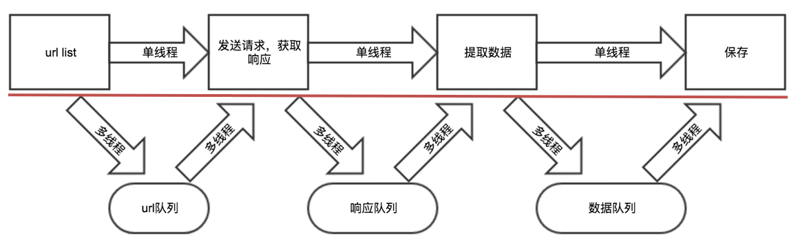

# 高性能爬虫实现

#### 学习目标

1. 掌握 threading模块的使用
2. 掌握 Queue模块的使用
3. 掌握 线程池的使用
4. 掌握 使用线程池实现爬虫的流程
5. 掌握 multiprocessing模块的使用
6. 了解 JoinableQueue的使用
7. 掌握 aiohttp模块的使用
8. 掌握 使用线程池实现爬虫的流程
   ​


​	通过前面的内容，我们已经能够完成一个爬虫，但是这个时候程序都是单线程，速度很慢。通过本节的学习，我们会掌握如何实现更高效的爬虫

## 一、单线程爬虫实现

​	回顾之前我们完成的爬虫任务，都是单线程爬虫我们来看一下单线程完成的代码耗时

```
import requests
import pymongo


class Aqiyi(object):
    def __init__(self):
        self.client = pymongo.MongoClient(host='127.0.0.1', port=27017)
        self.collection = self.client['spider']['aqy']
        self.headers = {
            'referer': 'https://list.iqiyi.com/www/2/15-------------11-1-1-iqiyi--.html?s_source=PCW_SC',
            'user-agent': 'Mozilla/5.0 (Windows NT 10.0; Win64; x64) AppleWebKit/537.36 (KHTML, like Gecko) Chrome/105.0.0.0 Safari/537.36',
            'x-requested-with': 'XMLHttpRequest'
        }
        self.url = 'https://pcw-api.iqiyi.com/search/recommend/list'


    def get_data(self, params):
        response = requests.get(self.url, headers=self.headers, params=params)
        return response.json()

    def parse_data(self, data):
        categoryVideos = data['data']['list']
        for video in categoryVideos:
            item = {}
            item['title'] = video['title']
            item['playUrl'] = video['playUrl']
            item['description'] = video['description']
            print(item)
            self.save_data(item)

    def save_data(self, item):
        self.collection.insert_one(item)


    def main(self):
        for page in range(1, 2):
            params = {
                'channel_id': '2',
                'data_type': '1',
                'mode': '11',
                'page_id': page,
                'ret_num': '48',
                'session': 'fc7d98794f15b224b169d328bf8f9f13',
                'three_category_id': '15;must',
            }
            data = self.get_data(params)
            self.parse_data(data)


if __name__ == '__main__':
    t1 = time.time()
    yk = Aqiyi()
    yk.main()
    print("total cost:", time.time() - t1)
```


## 二、多线程爬虫实现

> 在前面爬虫基础知识案例中我们发现请求回来的总数据不是太多,时间性对来说还是比较快的,那么如果该网站有大量数据等待爬虫爬取,我们是不是需要使用多线程并发来操作爬虫的网络请求呢?

### 1.回顾多线程的方法使用

在python3中，主线程主进程结束，子线程，子进程不会结束

为了能够让主线程回收子线程，可以把子线程设置为守护线程,即该线程不重要，主线程结束，子线程结束

```
t1 = threading.Thread(targe=func,args=(,))
t1.setDaemon(True)
t1.start() #此时线程才会启动

```

### 2.回顾队列模块的使用

```
from queue import Queue
q = Queue(maxsize=100)
item = {}
q.put_nowait(item) #不等待直接放，队列满的时候会报错
q.put(item) #放入数据，队列满的时候回等待
q.get_nowait() #不等待直接取，队列空的时候会报错
q.get() #取出数据，队列为空的时候会等待
q.qsize() #获取队列中现存数据的个数 
q.join() #队列中维持了一个计数，计数不为0时候让主线程阻塞等待，队列计数为0的时候才会继续往后执行
q.task_done() 
# put的时候计数+1，get不会-1，get需要和task_done 一起使用才会-1
```

### 3.多线程实现思路剖析

1. 把爬虫中的每个步骤封装成函数，分别用线程去执行
2. 不同的函数通过队列相互通信，函数间解耦 

### 4.具体代码实现

```
import threading
import requests
import pymongo
import time
from queue import Queue

class Aqiyi(object):
    def __init__(self):
        self.client = pymongo.MongoClient(host='127.0.0.1', port=27017)
        self.collection = self.client['spider']['aqy']
        self.headers = {
            'referer': 'https://list.iqiyi.com/www/2/15-------------11-1-1-iqiyi--.html?s_source=PCW_SC',
            'user-agent': 'Mozilla/5.0 (Windows NT 10.0; Win64; x64) AppleWebKit/537.36 (KHTML, like Gecko) Chrome/105.0.0.0 Safari/537.36',
            'x-requested-with': 'XMLHttpRequest'
        }
        self.url = 'https://pcw-api.iqiyi.com/search/recommend/list?channel_id=2&data_type=1&mode=11&page_id={}&ret_num=48&session=85dd981b69cead4b60f6d980438a5664&three_category_id=15;must'
        self.url_queue = Queue()
        self.json_queue = Queue()
        self.content_list_queue = Queue()

    def get_url(self):
        # print(2222222222222)
        for i in range(1, 3):
            self.url_queue.put(self.url.format(i))


    def get_data(self):
        while True:
            url = self.url_queue.get()
            # print(url)
            response = requests.get(url, headers=self.headers)
            time.sleep(1)
            print(response.json())
            self.json_queue.put(response.json())
            self.url_queue.task_done()

    def parse_data(self):
        while True:
            data = self.json_queue.get()
            print(data)
            categoryVideos = data['data']['list']
            for video in categoryVideos:
                item = {}
                item['title'] = video['title']
                item['playUrl'] = video['playUrl']
                item['description'] = video['description']
                self.content_list_queue.put(item)
            self.json_queue.task_done()

    def save_data(self):

        while True:
            item = self.content_list_queue.get()
            print(item)
            self.collection.insert_one(item)
            self.content_list_queue.task_done()


    def main(self):
        thread_list = []
        # 1.url_list
        t_url = threading.Thread(target=self.get_url)
        thread_list.append(t_url)
        # 2.遍历，发送请求，
        # print(1111)
        for i in range(3):  # 三个线程发送请求
            t_parse = threading.Thread(target=self.get_data)
            thread_list.append(t_parse)
        # 3.提取数据
        t_content = threading.Thread(target=self.parse_data)
        thread_list.append(t_content)
        # 4.保存
        t_save = threading.Thread(target=self.save_data)
        thread_list.append(t_save)
        # print(1111)
        for t in thread_list:
            t.setDaemon(True)  # 把子线程设置为守护线程，当前这个线程不重要，主线程结束，子线程结束
            t.start()
            # print(11111111111)

        for q in [self.url_queue, self.json_queue, self.content_list_queue]:
            q.join()  # 让主线程阻塞，等待队列的计数为0，

        print("主线程结束")

if __name__ == '__main__':
    t1 = time.time()
    yk = Aqiyi()
    yk.main()
    print("total cost:", time.time() - t1)
```

##### 注意点：

- put会让队列的计数+1，但是单纯的使用get不会让其-1，需要和task_done同时使用才能够-1
- task_done不能放在另一个队列的put之前，否则可能会出现数据没有处理完成，程序结束的情况


## 三、线程池实现爬虫

### 1.线程池使用方法介绍

1. 线程池，是一种线程的使用模式，它为了降低线程使用中频繁的创建和销毁所带来的资源消耗与代价。通过创建一定数量的线程，让他们时刻准备就绪等待新任务的到达，而任务执行结束之后再重新回来继续待命

2. 实例化线程池对象

   ```
   from concurrent.futures import ThreadPoolExecutor 
   def crawl(url): 
   	print(url) 
   if __name__ == '__main__0': 
   	base_url = 'https://jobs.51job.com/pachongkaifa/p{}/' 
   	with ThreadPoolExecutor(10) as f: 
   	for i in range(1,15): 
   		f.submit(crawl,url=base_url.format(i))
   ```

   ​

3. 使用线程池来执行线程任务的步骤如下：

   1. 调用 ThreadPoolExecutor 类的构造器创建一个线程池。
   2. 定义一个普通函数作为线程任务。
   3. 调用 ThreadPoolExecutor 对象的 submit() 方法来提交线程任务。
   4. 当不想提交任何任务时，调用 ThreadPoolExecutor 对象的 shutdown() 方法来关闭线程池。

   ```
   from concurrent.futures import ThreadPoolExecutor
   import threading
   import time

   # 定义一个准备作为线程任务的函数
   def action(max):
       my_sum = 0
       for i in range(max):
           print(threading.current_thread().name + '  ' + str(i))
           my_sum += i
       return my_sum
   # 创建一个包含2条线程的线程池
   pool = ThreadPoolExecutor(max_workers=2)
   # 向线程池提交一个task, 50会作为action()函数的参数
   future1 = pool.submit(action, 50)
   # 向线程池再提交一个task, 100会作为action()函数的参数
   future2 = pool.submit(action, 100)
   # 判断future1代表的任务是否结束
   print(future1.done())
   time.sleep(3)
   # 判断future2代表的任务是否结束
   print(future2.done())
   # 查看future1代表的任务返回的结果
   print(future1.result())
   # 查看future2代表的任务返回的结果
   print(future2.result())
   # 关闭线程池
   pool.shutdown()
   ```


### 2.使用线程池实现爬虫的具体实现

```
import time

import requests
import pymysql
from concurrent.futures import ThreadPoolExecutor

class Baidu(object):
    def __init__(self):
        self.db = pymysql.connect(host="localhost", user="root", password="root", db="spiders")
        self.cursor = self.db.cursor()
        self.url = 'https://talent.baidu.com/httservice/getPostListNew'
        self.headers = {
            'Referer': 'https://talent.baidu.com/jobs/social-list?search=python',
            'User-Agent': 'Mozilla/5.0 (Windows NT 10.0; Win64; x64) AppleWebKit/537.36 (KHTML, like Gecko) Chrome/105.0.0.0 Safari/537.36'
        }

    def get_data(self, page):  # 获取地址和User-Agent
        data = {
            'recruitType': 'SOCIAL',
            'pageSize': 10,
            'keyWord': '',
            'curPage': page,
            'projectType': '',
        }
        response = requests.post(url=self.url, headers=self.headers, data=data)
        return response.json()

    def parse_data(self, response):
        # print(response)
        data_list = response["data"]['list']
        for node in data_list:
            education = node['education'] if node['education'] else '空'

            name = node['name']
            serviceCondition = node['serviceCondition']
            self.save_data(education, name, serviceCondition)

    def create_table(self):
        # 使用预处理语句创建表
        sql = '''
                    CREATE TABLE IF NOT EXISTS baidu(
                        id int primary key auto_increment not null,
                        education VARCHAR(255) NOT NULL, 
                        name VARCHAR(255) NOT NULL, 
                        serviceCondition TEXT)
                    '''
        try:
            self.cursor.execute(sql)
            print("CREATE TABLE SUCCESS.")
        except Exception as ex:
            print(f"CREATE TABLE FAILED,CASE:{ex}")


    def save_data(self,education, name, serviceCondition):
        # SQL 插入语句
        sql = 'INSERT INTO baidu(id, education, name, serviceCondition) values(%s, %s, %s, %s)'
        # 执行 SQL 语句
        try:
            self.cursor.execute(sql, (0, education, name, serviceCondition))
            # 提交到数据库执行
            self.db.commit()
            print('数据插入成功...')
        except Exception as e:
            print(f'数据插入失败: {e}')
            # 如果发生错误就回滚
            self.db.rollback()

    def run(self):
        self.create_table()
        with ThreadPoolExecutor(max_workers=5)as pool:
            for i in range(1, 6):
                response = pool.submit(self.get_data, i)
                self.parse_data(response.result())

        # 关闭数据库连接
        self.db.close()

if __name__ == '__main__':
    t1 = time.time()
    baidu = Baidu()
    baidu.run()
    print("总耗时:", time.time() - t1)
```


## 四、多进程爬虫

> 前面这种方式由于GIL全局锁的存在，多线程在python3下可能只是个摆设，对应的解释器执行其中的内容的时候仅仅是顺序执行，此时我们可以考虑多进程的方式实现，思路和多线程相似，只是对应的api不相同。


### 1 回顾多进程程的方法使用

```
from multiprocessing import Process  #导入模块
t1 = Process(targe=func,args=(,)) #使用一个进程来执行一个函数
t1.daemon = True  #设置为守护进程
t1.start() #此时进程才会启动
```


### 2 多进程中队列的使用

多进程中使用普通的队列模块会发生阻塞，对应的需要使用`multiprocessing`提供的`JoinableQueue`模块，其使用过程和在线程中使用的queue方法相同


### 3 具体实现

具体的实现如下:

```
#!/usr/bin/env python
# -*- encoding: utf-8 -*-

import requests
import pymongo
import time
from multiprocessing import Process
from multiprocessing import JoinableQueue as Queue


client = pymongo.MongoClient(host='127.0.0.1', port=27017)
collection = client['spider']['aqy']

class Aqiyi():
    def __init__(self):

        self.headers = {
            'referer': 'https://list.iqiyi.com/www/2/15-------------11-1-1-iqiyi--.html?s_source=PCW_SC',
            'user-agent': 'Mozilla/5.0 (Windows NT 10.0; Win64; x64) AppleWebKit/537.36 (KHTML, like Gecko) Chrome/105.0.0.0 Safari/537.36',
            'x-requested-with': 'XMLHttpRequest'
        }
        self.url = 'https://pcw-api.iqiyi.com/search/recommend/list?channel_id=2&data_type=1&mode=11&page_id={}&ret_num=48&session=85dd981b69cead4b60f6d980438a5664&three_category_id=15;must'
        self.url_queue = Queue()
        self.json_queue = Queue()
        self.content_list_queue = Queue()

    def get_url(self):
        for i in range(1, 10):
            self.url_queue.put(self.url.format(i))


    def get_data(self):
        while True:
            url = self.url_queue.get()
            # print(url)
            response = requests.get(url, headers=self.headers)
            self.json_queue.put(response.json())
            self.url_queue.task_done()

    def parse_data(self):
        while True:
            data = self.json_queue.get()
            # print(data)
            categoryVideos = data['data']['list']
            for video in categoryVideos:
                item = {}
                item['title'] = video['title']
                item['playUrl'] = video['playUrl']
                item['description'] = video['description']
                self.content_list_queue.put(item)
            self.json_queue.task_done()

    def save_data(self):

        while True:
            item = self.content_list_queue.get()
            print(item)
            collection.insert_one(item)
            self.content_list_queue.task_done()

    def main(self):
        process_list = []
        # 1. url_list
        t_url = Process(target=self.get_url)
        process_list.append(t_url)
        # 2. 遍历，发送请求
        for i in range(5):  # 创建5个子进程
            t_parse = Process(target=self.get_data)
            process_list.append(t_parse)
        # 3. 提取数据
        t_content = Process(target=self.parse_data)
        process_list.append(t_content)
        # 4. 保存
        for i in range(3):
            t_save = Process(target=self.save_data)
            process_list.append(t_save)
        for t in process_list:
            # print(t)
            t.daemon = True  # 把进程设置为守护线程，主进程结束，子进程结束
            t.start()
            time.sleep(0.2)

        for q in [self.url_queue, self.json_queue, self.content_list_queue]:
            print(q)
            q.join()  # 让主线程阻塞，等待队列的计数为0，


        print("主进程结束")

if __name__ == '__main__':
    t1 = time.time()
    yk = Aqiyi()
    yk.main()
    print("total cost:", time.time() - t1)

```

**注意：**

​	上述多进程实现的代码中，multiprocessing提供的JoinableQueue可以创建可连接的共享进程队列。和普通的Queue对象一样，队列允许项目的使用者通知生产者项目已经被成功处理。通知进程是使用共享的信号和条件变量来实现的。 对应的该队列能够和普通队列一样能够调用task_done和join方法

初始化mongo可能会引起：TypeError: cannot pickle '_thread.lock' object


## 五、异步协程爬虫

我们知道爬虫是 IO 密集型任务，比如如果我们使用 requests 库来爬取某个站点的话，发出一个请求之后，程序必须要等待网站返回响应之后才能接着运行，而在等待响应的过程中，整个爬虫程序是一直在等待的，实际上没有做任何的事情。对于这种情况我们有没有优化方案呢？

### 1.基本概念

**异步**

为完成某个任务，不同程序单元之间过程中无需通信协调，也能完成任务的方式，不相关的程序单元之间可以是异步的。

例如，爬虫下载网页。调度程序调用下载程序后，即可调度其他任务，而无需与该下载任务保持通信以协调行为。不同网页的下载、保存等操作都是无关的，也无需相互通知协调。这些异步操作的完成时刻并不确定。

**同步**

不同程序单元为了完成某个任务，在执行过程中需靠某种通信方式以协调一致，我们称这些程序单元是同步执行的。

**阻塞**

阻塞状态指程序未得到所需计算资源时被挂起的状态。程序在等待某个操作完成期间，自身无法继续处理其他的事情，则称该程序在该操作上是阻塞的。

**非阻塞**

程序在等待某操作过程中，自身不被阻塞，可以继续处理其他的事情，则称该程序在该操作上是非阻塞的。

同步/异步关注的是消息通信机制 (synchronous communication/ asynchronouscommunication) 。

阻塞/非阻塞关注的是程序在等待调用结果（消息，返回值）时的状态. 


### 2.协程异步实现方法

```
pip install aiohttp
```

aiohttp是一个为Python提供异步HTTP 客户端/服务端编程，基于asyncio(Python用于支持异步编程的标准库)的异步库。asyncio可以实现单线程并发IO操作，其实现了TCP、UDP、SSL等协议，aiohttp就是基于asyncio实现的http框架。

async 用来声明一个函数为异步函数

await 用来声明程序挂起，比如异步程序执行到某一步时需要等待的时间很长，就将此挂起，去执行其他的异步程序


### 3.同步异步对比

**同步**

```
import time
import requests
def main():
    for i in range(30):
        res = requests.get('https://www.baidu.com')
        print(f'第{i + 1}次请求，status_code = {res.status_code}')

if __name__ == '__main__':
    start = time.time()
    main()
    end = time.time()
    print(f'同步发送30次请求，耗时：{end - start}')
```

**异步**

```
import asyncio
import aiohttp


async def requests_data(client,i):
    res = await client.get('https://www.baidu.com')
    print(f'第{i + 1}次请求，status_code = {res.status}')
    # await asyncio.sleep(1)
    return res


async def main():
    # 生明一个异步的上下文管理器，能帮助我们自己的分配和释放资源
    # aiohttp.ClientSession()   类似requests的sessi()
    async with aiohttp.ClientSession() as client:
        task_list = []
        for i in range(30):
            # 获取到协程对象
            res = requests_data(client, i)
            # 创建task对象
            task = asyncio.create_task(res)
            task_list.append(task)
            # 直接执行异步对象任务，会阻塞
            # await requests_data(client, i)
        # 等待执行的异步 将task对象交有event_loop来控制
        await asyncio.wait(task_list)


if __name__ == '__main__':
    start = time.time()
    # 开启事件循环对象
    loop = asyncio.get_event_loop()
    # 用事件循环对象开启协程异步对象
    loop.run_until_complete(main())
    end = time.time()
    print(f'同步发送30次请求，耗时：{end - start}')


```


### 4.异步爬虫实战

**需求：**

​	采集王者荣耀官网里面所有的图片信息

​	网址：https://pvp.qq.com/web201605/herolist.shtml

```
#!/usr/bin/env python
# -*- encoding: utf-8 -*-
# @File  :   异步图片爬虫案列.py
# Author :   柏汌
import os

import requests
import asyncio  # asyncio是Python3.4引入的一个标准库，直接内置了对异步IO的支持。asyncio模块提供了使用协程构建并发应用的工具
import aiohttp  # 异步请求库aiohttp 加快图片 url 的网页请求
import time

class Crawl_Image:
    def __init__(self):
        self.skin_url = 'https://game.gtimg.cn/images/yxzj/img201606/skin/hero-info/{}/{}-bigskin-{}.jpg'
        self.url = 'https://pvp.qq.com/web201605/js/herolist.json'
        self.headers = {
            'user-agent': 'Mozilla/5.0 (Windows NT 10.0; WOW64) AppleWebKit/537.36 (KHTML, like Gecko) Chrome/67.0.3396.99 Safari/537.36',
        }

    async def download_image(self, session, ename, cname):
        for i in range(1, 10):
            response = await session.get(self.skin_url.format(ename, ename, i), headers=self.headers)
            # status获取到状态码
            if response.status == 200:
                # read 获取到进制数据
                content = await response.read()
                with open("图片/" + cname + "-" + str(i) + '.jpg', 'wb') as f:
                    f.write(content)
                print('下载{}第{}张图片成功'.format(cname, str(i)))
            else:
                break


    async def run(self):

        async with aiohttp.ClientSession() as session:
            response = await session.get(self.url, headers=self.headers)
            wzry_data = await response.json(content_type=None)
            tasks = []
            for i in wzry_data:
                ename = i['ename']
                cname = i['cname']
                # 获取协程对象
                res = self.download_image(session, ename, cname)
                # 将协程对象转换成task对象 才能做到异步
                task = asyncio.create_task(res)
                tasks.append(task)
            # 等待执行的异步 将task对象交由event_loop来控制
            await asyncio.wait(tasks)


if __name__ == '__main__':
    if not os.path.exists('图片'):
        os.mkdir('图片')
    start = time.time()
    crawl_image = Crawl_Image()
    # 获取事件循环 Eventloop 我们想运用协程，首先要生成一个loop对象，然后loop.run_xxx()就可以运行协程了，而如何创建这个loop, 方法有两种：对于主线程是loop=get_event_loop().
    loop = asyncio.get_event_loop()
    # 执行协程
    loop.run_until_complete(crawl_image.run())
    print('运行时间{}'.format(time.time() - start))

```


**需求：**

​	通过异步的方式获取到Scrape | Book里面30个页的书籍信息

​	网址：https://spa5.scrape.center/page/3

```
#!/usr/bin/env python
# -*- encoding: utf-8 -*-
# Author :   柏汌
import time
import aiohttp
import asyncio
import aiomysql

class Scrape_spider():
    def __init__(self):
        self.url = 'https://spa5.scrape.center/api/book/?limit=18&offset={}'
        self.headers = {
            'User-Agent': 'Mozilla/5.0 (Windows NT 10.0; Win64; x64) AppleWebKit/537.36 (KHTML, like Gecko) Chrome/105.0.0.0 Safari/537.36'
        }


    async def get_data(self, page, client, db, cursor):
        response = await client.get(self.url.format(page * 18))
        # print(response.r)
        json_data = await response.json()
        for data in json_data['results']:
            item = {}
            item['authors'] = ','.join(''.join(x.strip() for x in i.strip().split('\n')) for i in data['authors'])
            item['title'] = data['name']
            item['score'] = data['score']
            await self.save_data(item, db, cursor)


    async def save_data(self, item, db, cursor):
        # sql插入语法
        sql = 'INSERT INTO books(id, authors, title, score) values(%s, %s, %s, %s)'
        try:
            await cursor.execute(sql, (0, item['authors'], item['title'], item['score']))
            # 提交到数据库执行
            await db.commit()
            print('数据插入成功...')
        except Exception as e:
            print(f'数据插入失败: {e}')
            # 如果发生错误就回滚
            await db.rollback()

    async def main(self):
        # 连接mysql
        db = await aiomysql.connect(host='127.0.0.1', port=3306, user='root', password='root', db='spiders')
        # 创建游标
        cursor = await db.cursor()
        # 使用预处理语句创建表
        create_sql = '''
                    CREATE TABLE IF NOT EXISTS books(
                        id int primary key auto_increment not null,
                        authors VARCHAR(255) NOT NULL, 
                        title VARCHAR(255) NOT NULL, 
                        score VARCHAR(255) NOT NULL
                        );
                    '''
        # 执行sql
        await cursor.execute(create_sql)
        async with aiohttp.ClientSession() as client:
            tasks = []
            for i in range(2):
                res = self.get_data(i, client, db, cursor)
                task = asyncio.create_task(res)
                tasks.append(task)
            await asyncio.wait(tasks)
        db.close()


if __name__ == '__main__':

    start = time.time()
    crawl_book = Scrape_spider()
    # 获取事件循环 Eventloop 我们想运用协程，首先要生成一个loop对象，然后loop.run_xxx()就可以运行协程了，而如何创建这个loop, 方法有两种：对于主线程是loop=get_event_loop().
    loop = asyncio.get_event_loop()
    # 执行协程
    loop.run_until_complete(crawl_book.main())
    print('运行时间{}'.format(time.time() - start))

```


## 六、课后作业

要求：通过异步的方式获取到英雄联盟官网的英雄皮肤图片

网址：https://101.qq.com/#/hero


